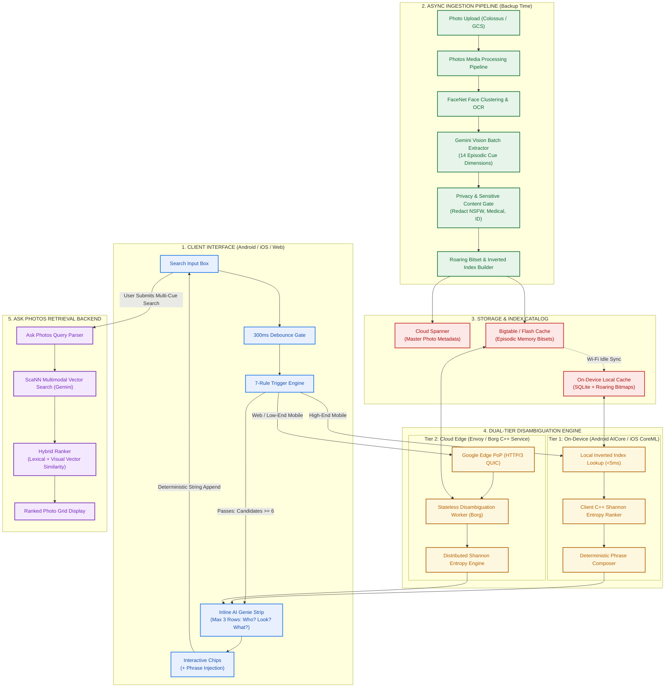
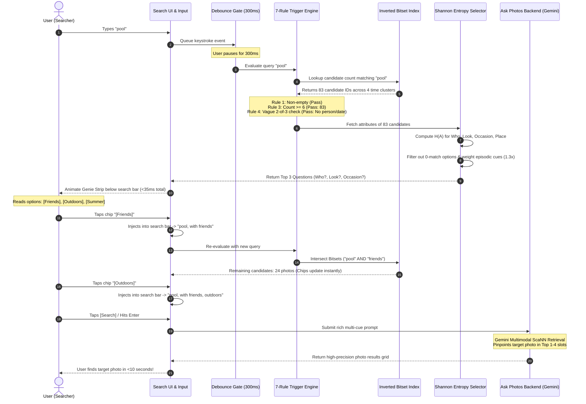
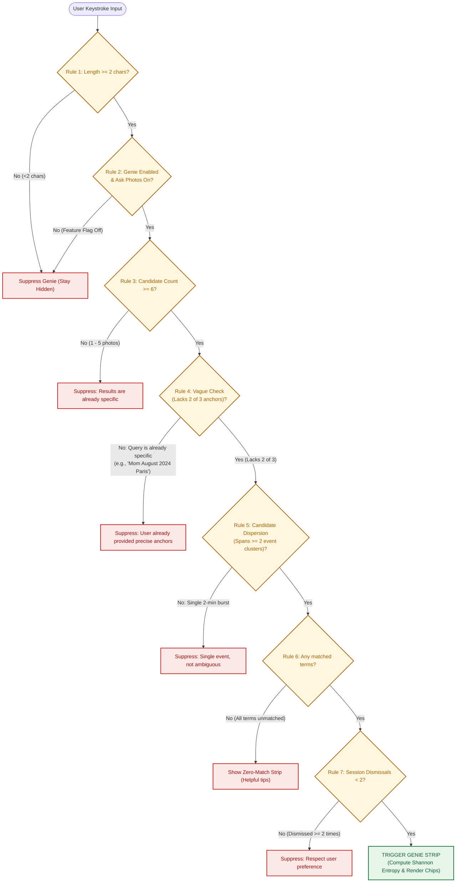

# Google Photos: AI Genie Production System Architecture Diagrams

This document contains production architecture diagrams for integrating the **AI Genie** pre-search assistant into **Google Photos**.

---

## 1. End-to-End System Architecture

---

## 2. Real-Time Serving Sequence Diagram (Sub-50ms Keystroke Path)

---

## 3. Asynchronous Backup Ingestion Pipeline (One-Time Media Scan)

```mermaid
flowchart LR
    %% STYLING
    classDef step fill:#E8F0FE,stroke:#1A73E8,stroke-width:2px,color:#174EA6;
    classDef ai fill:#F3E8FD,stroke:#7627BB,stroke-width:2px,color:#7627BB;
    classDef safety fill:#FCE8E6,stroke:#C5221F,stroke-width:2px,color:#A50E0E;
    classDef db fill:#E6F4EA,stroke:#137333,stroke-width:2px,color:#0D652D;

    A["New Photo Uploaded\n(Device Backup)"] --> B["PMP Base Processing\n(EXIF, GPS, FaceNet)"]
    B --> C["Gemini Vision Flash\nBatch Pipeline (TPU v5e)"]
    
    subgraph GEMINI_TAGGING ["14 Episodic Dimensions Extracted"]
        C1["Who: Solo / Friends / Family"]
        C2["Setting: Beach / Pool / Café"]
        C3["Look: Red dress / Outdoors / Night"]
        C4["Occasion: Birthday / Trip / Festival"]
        C5["Activity: Swimming / Dining / Dancing"]
    end
    C --> GEMINI_TAGGING
    GEMINI_TAGGING --> D["Sensitive Content\n& Privacy Filter"]
    
    D -- "Safe" --> E["Bitset Serializer\n(Roaring Bitmap IDs)"]
    D -- "Sensitive/NSFW/Medical" --> F["Flag is_sensitive = true\n(Excluded from Chips)"]

    E --> G[("Cloud Spanner\n& Bigtable")]
    G -. "Background Delta Sync" .-> H[("Client SQLite Cache")]

    class A,B,E step;
    class C,C1,C2,C3,C4,C5 ai;
    class D,F safety;
    class G,H db;
```

---

## 4. Algorithmic Decision Tree: The 7-Rule Trigger Engine

